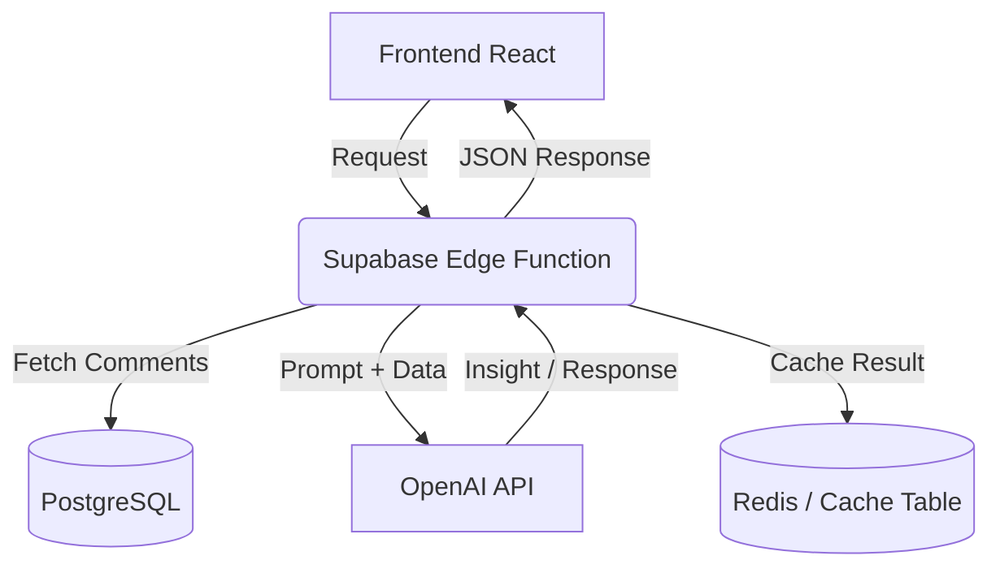

# Roadmap Técnico: AI Helper (Plan Pro)

Este documento detalla la planificación técnica para la integración de inteligencia artificial en la aplicación, diseñada para analizar los comentarios de los negocios y ofrecer insights accionables.

## 1. Objetivo de la Feature
Proporcionar a los usuarios del **Plan Pro** una herramienta de análisis inteligente que:
- Sintetice automáticamente cientos de comentarios.
- Identifique problemas críticos y patrones recurrentes.
- Permita la interacción dinámica mediante un chat contextual sobre el feedback recibido.

## 2. Arquitectura Propuesta

Se propone una arquitectura **Serverless** utilizando Supabase y OpenAI para mantener costes bajos y una implementación rápida.

### Componentes Clave:
- **Frontend**: Integración en el `DashboardPage` debajo de la sección de estadísticas avanzadas.
- **Backend**: Supabase Edge Functions (Deno) para orquestar la comunicación con OpenAI.
- **IA**: OpenAI `gpt-4o-mini` para el MVP (mejor relación calidad-precio) y `gpt-4o` para tareas complejas.

## 3. Flujo de Datos

1.  **Activación**: El usuario accede al Dashboard. Si es Pro, se habilita el widget de AI Helper.
2.  **Recopilación**: La Edge Function recupera los comentarios del `business_id` solicitante.
3.  **Procesamiento**: Se seleccionan los comentarios más relevantes o recientes (ventana de tiempo).
4.  **Generación**: OpenAI genera el resumen y la detección de problemas.
5.  **Interacción**: El usuario realiza preguntas; la Edge Function mantiene el contexto de los comentarios para responder.

## 4. Decisiones Técnicas Justificadas

### ¿Embeddings y Vector Search?
- **MVP (Fase 1)**: **NO**. Para la mayoría de negocios (MVP), el volumen de comentarios (100-500) cabe en el contexto de GPT-4o-mini (128k tokens). Inyectar el texto directamente ahorra costes de infraestructura y complejidad.
- **Mejoras (Fase 2)**: **SÍ**. Para negocios con miles de comentarios, se implementará `pgvector` en Supabase para realizar Search Semántico y RAG (Retrieval-Augmented Generation).

### ¿Resumen en Batch o Tiempo Real?
- **MVP**: **Tiempo Real con Cache**. El resumen se genera bajo demanda cuando el usuario entra al dashboard, pero se cachea durante 24h para evitar llamadas innecesarias.
- **Mejoras**: **Batch Semanal**. Generación automática de reportes semanales enviados por email.

### Sistema de Chat
- Se implementará una interfaz de **Chat Contextual** (tipo barra lateral o widget expandible) donde el sistema siempre tiene "en memoria" los comentarios del negocio.

### Estrategia de Caching
- Almacenamiento de respuestas en una tabla `ai_cache` vinculada al `business_id` y al `hash` del conjunto de comentarios procesados. Si el feedback no ha cambiado, se sirve desde el cache.

## 5. Fases de Implementación

### Fase 1: MVP Funcional (2-3 semanas)
- [ ] **UI**: Widget "AI Insight" con diseño premium.
- [ ] **Edge Function**: Endpoint para resumen y análisis de problemas.
- [ ] **Seguridad**: RLS estricto para asegurar que un negocio no pueda preguntar por comentarios de otro.
- [ ] **Detección**: Lista de "Top 3 Problemas" y "Top 3 Fortalezas".

### Fase 2: Mejoras Avanzadas
- [ ] **Vector Search**: Implementación de RAG para grandes volúmenes de datos.
- [ ] **Sentiment Trends**: Gráficas de sentimiento impulsadas por IA.
- [ ] **Auto-Reply**: Sugerencias de respuestas automáticas para el dueño del negocio.
- [ ] **Multilingüe**: Traducción y análisis en múltiples idiomas.

## 6. Estimación de Costos (OpenAI gpt-4o-mini)

| Concepto | Coste Aprox (por 1k tokens) | Coste Mensual Estimado (Negocio Pro) |
| :--- | :--- | :--- |
| **Input** | $0.00015 | ~$0.15 (1k comentarios/mes) |
| **Output** | $0.0006 | ~$0.45 (Análisis y Chat) |
| **Total** | | **<$1.00 por usuario activo** |

> [!TIP]
> El uso de `gpt-4o-mini` permite que la feature sea extremadamente rentable incluso con una cuota Pro competitiva.

## 7. Riesgos Técnicos y Mitigación
- **Alucinaciones**: Limitar el prompt para que la IA solo responda basándose en los datos proporcionados ("Si no está en los comentarios, di que no lo sabes").
- **Límites de Contexto**: Para negocios muy grandes en el MVP, truncar comentarios por fecha (últimos 3 meses).
- **Seguridad**: Los comentarios se anonimizan antes de enviarse a OpenAI (quitar nombres de clientes si los hubiera).

## 8. Métricas de Éxito
- **Engagement**: Porcentaje de usuarios Pro que hacen al menos 1 pregunta al mes.
- **Conversión**: Usuarios que pasan de Basic a Pro tras ver la landing de AI Helper.
- **Precisión**: Feedback cualitativo de los usuarios sobre la utilidad del resumen.

## 9. Seguridad y Aislamiento
- Cada llamada a la Edge Function requiere un JWT válido de Supabase.
- El filtrado de datos se realiza en el servidor SQL antes de enviarlos a la IA, garantizando que el `business_id` coincida con el usuario autenticado.
